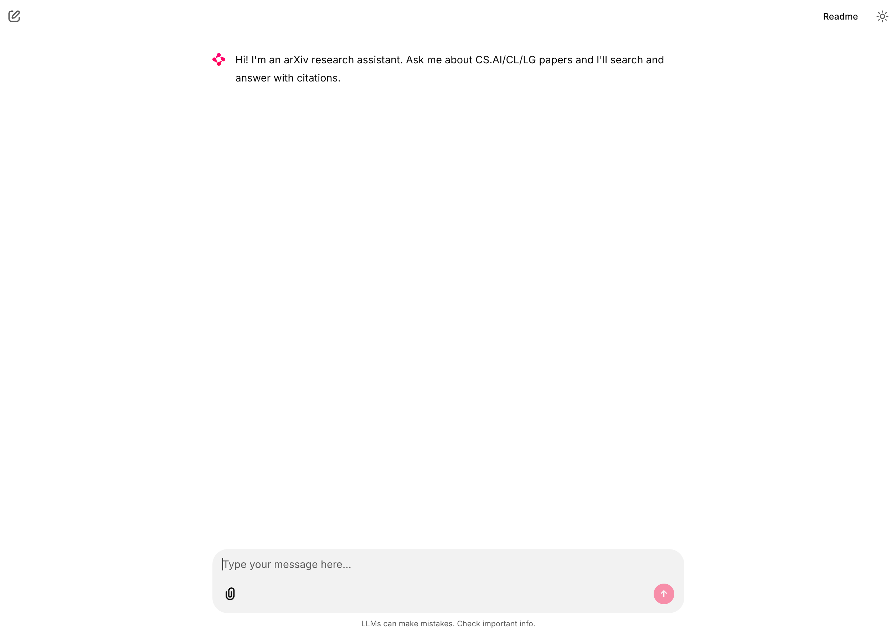
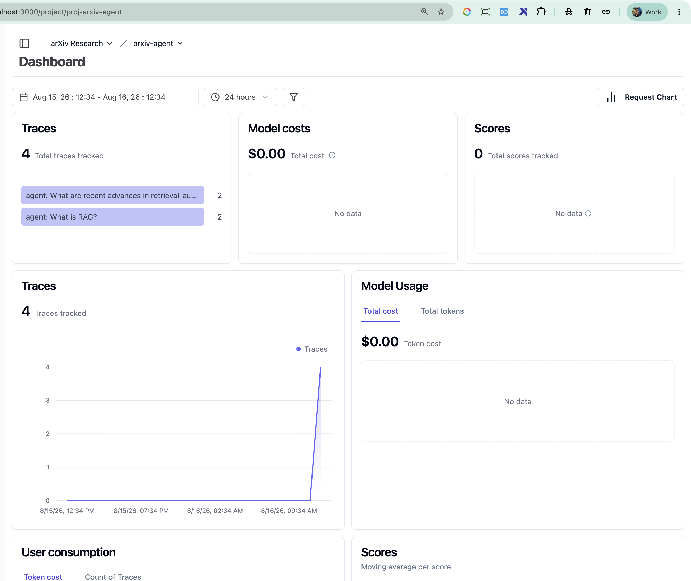
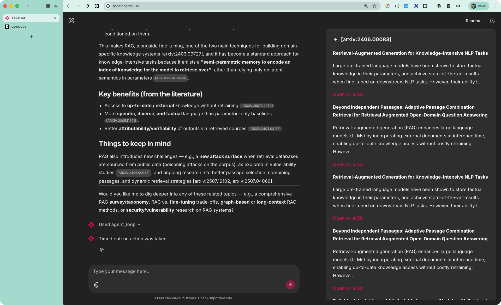

# arXiv AI Research Assistant

A conversational research copilot over arXiv CS.AI / CS.CL / CS.LG papers. Ask
an open-ended ML question; the agent reasons, searches a hybrid (keyword +
vector) knowledge base, rewrites queries, re-ranks, optionally fetches fresh
arXiv metadata, and answers with **cited arXiv IDs**.

> LLM Zoomcamp final project. See
> [`arxiv-agent-design.md`](docs/superpowers/specs/2026-07-26-arxiv-agent-design.md)
> for the full design rationale.

## Problem

Researchers struggle to get grounded, cited answers over the fast-moving arXiv
literature. Standard web search surfaces non-archival or low-quality sources,
and even RAG systems often fail to *cite what they used*. This project builds
an agentic RAG system over arXiv that decides when and how to search, cites its
sources, and exposes a chat interface with monitoring and evaluation.

## Evaluation criteria

Mapping of this submission to the [LLM Zoomcamp grading
rubric](https://github.com/DataTalksClub/llm-zoomcamp/blob/main/project.md).
Every core criterion and best-practice bonus targets full marks; the
cloud-deployment bonus was not attempted.

| Criterion | What we did |
|---|---|
| **Problem description** | See [Problem](#problem) above. |
| **Retrieval flow** (KB + LLM, not LLM-only) | The [agent](#stack) calls the Qdrant knowledge base (`search_papers` tool) *and* the LLM on every turn — never answers from parametric knowledge alone. |
| **Retrieval evaluation** | 5 retrieval variants evaluated head-to-head (keyword / vector / hybrid / hybrid+rerank / hybrid+rerank+rewrite); best (`hybrid_rerank`) is used in production. See [Retrieval evaluation](#retrieval-evaluation). |
| **LLM evaluation** | 2 prompt variants compared with an LLM-as-judge (relevance + usefulness); best documented. See [LLM evaluation](#llm-evaluation). |
| **Interface** | A Chainlit **web chat UI** (not just a CLI) with streamed answers, a citations sidebar, and thumbs feedback. See [Interface](#interface). |
| **Ingestion pipeline** | Fully **automated** with `dlt` (incremental state, rate-limiting, retry with backoff) — not a one-off notebook. See [Ingestion pipeline](#ingestion-pipeline). |
| **Monitoring** | Self-hosted Langfuse: user feedback (thumbs) **and** a 6-chart dashboard. See [Langfuse monitoring](#langfuse-monitoring-one-time-setup). |
| **Containerization** | **Everything** — app, Qdrant, and self-hosted Langfuse (+ its Postgres/ClickHouse/Redis/MinIO deps) — in one `docker-compose.yml`. See [Containerization](#containerization). |
| **Reproducibility** | Pinned dependency lockfile, pinned image tags, a documented one-command stack, verified end-to-end on two independent machines. See [Reproducibility](#reproducibility). |
| **Best practice: hybrid search** (+1) | Evaluated explicitly as its own row (`hybrid`, RRF fusion of sparse + dense) — [Retrieval evaluation](#retrieval-evaluation). |
| **Best practice: document re-ranking** (+1) | Cross-encoder reranker; `hybrid_rerank` is the best-scoring and production variant — [Retrieval evaluation](#retrieval-evaluation). |
| **Best practice: query rewriting** (+1) | A `rewrite_query` tool is wired into the agent and evaluated as its own `hybrid_rerank_rewrite` row — [Retrieval evaluation](#retrieval-evaluation). |
| **Bonus: cloud deployment** (+2) | Not attempted — this submission runs locally via `docker compose`. |

## Stack

- **LLM**: `Hy3` via an OpenAI-compatible proxy (opencode-go), env-swappable.
  Native function-calling support was verified with a capability probe
  (`uv run python -m arxiv_agent.capability_probe` → `tool_calling=yes`)
  before committing to a native tool-calling agent loop over an
  instruction-based fallback.
- **Knowledge base**: Qdrant with native hybrid (sparse SPLADE + dense
  bge-small) and RRF fusion, plus a cross-encoder reranker.
- **Ingestion**: dlt pulling the arXiv API (incremental state, rate-limited,
  retry with backoff).
- **Agent**: handwritten tool-calling loop (Module-1 style) with a 3-tool
  registry (`search_papers`, `fetch_arxiv`, `rewrite_query`).
- **Interface**: Chainlit (chat + thumbs feedback wired to Langfuse scores).
- **Monitoring**: self-hosted Langfuse v2 (tracing + 6-chart dashboard).
- **Containerization**: full docker-compose stack (app + qdrant + langfuse +
  deps), runs on colima.

## Prerequisites

| Requirement | Version / notes |
|---|---|
| macOS with a Docker runtime | [colima](https://github.com/abiosoft/colima) (used throughout this README) or Docker Desktop — either works, `docker compose` doesn't care which |
| [`uv`](https://docs.astral.sh/uv/) | manages the Python 3.12 venv; installs Python 3.12 automatically if you don't have it |
| Free disk space | **≥25GiB** before any `docker compose build`/`up` — colima's VM disk grows on the host disk and a full disk corrupts the VM (see Troubleshooting) |
| An `Hy3`-compatible API key | via the `opencode-go` proxy — see `.env.example` |

No other manual installs are required — `uv sync` pulls every Python
dependency (including `sentence-transformers`/`torch` for the reranker and
`fastembed` for embeddings) into a local `.venv`.

## Project structure

```
arxiv_agent/            agent loop, LLM client, KB search, reranker, tracing
  tools/                tool registry: search_papers, fetch_arxiv, rewrite_query
pipeline/               dlt ingestion: sources/arxiv.py + ingest.py runner
interface/              Chainlit chat app (agent + citations + thumbs)
eval/                   ground-truth builder, retrieval eval, LLM eval + CSVs
langfuse/               provisioning script, dashboard.json, setup notes
tests/                  32 pytest tests (agent, tools, KB, ingest, interface)
docker-compose.yml      full stack (app, qdrant, langfuse + deps, ingest profile)
Dockerfile              app image (uv-synced, dev deps excluded)
docs/                   design spec + screenshots
```

## Quick start (macOS / colima)

```bash
# 1. Start the Docker runtime (skip if using Docker Desktop instead)
#    Keep >=25GiB free on the host disk before this - see Troubleshooting.
colima start --cpu 4 --memory 6 --disk 80

# 2. Configure environment (fill in OPENCODE_GO_API_KEY; Langfuse keys added in step 6)
cp .env.example .env

# 2b. Generate Langfuse self-host crypto material (one-time per fresh stack;
#     do NOT regenerate these on a stack you already provisioned - it
#     invalidates the API keys added in step 6)
for k in NEXTAUTH_SECRET ENCRYPTION_KEY SALT; do
  echo "$k=$(openssl rand -hex 32)" >> .env
done

# 3. Install dependencies (Python 3.12; uv manages the venv)
uv sync --locked
uv run pytest tests/ -v                # -> 32 passed

# 4. Bring up Qdrant + Langfuse first (app needs Langfuse reachable to start)
docker compose up -d qdrant langfuse-web langfuse-worker
curl -s http://localhost:6333/healthz  # -> healthz check passed
curl -s -o /dev/null -w '%{http_code}\n' http://localhost:3000  # -> 200

# 5. Populate the knowledge base (first run only; ~10-15 min)
uv run python -m pipeline.ingest

# 6. Provision Langfuse (one-time): sign up at http://localhost:3000/auth/sign-up,
#    create an org + project via the onboarding wizard, generate an API key
#    under Settings -> API Keys, then add it to .env:
#    LANGFUSE_PUBLIC_KEY=pk-lf-...
#    LANGFUSE_SECRET_KEY=sk-lf-...
#    See langfuse/README.md for a headless (no-browser) provisioning path.

# 7. Build and start the app
docker compose build app && docker compose up -d app
curl -s -o /dev/null -w '%{http_code}\n' http://localhost:8000   # -> 200

# 8. Open the chat UI
open http://localhost:8000
```

> **Scripted alternative**: [`scripts/bootstrap.sh`](scripts/bootstrap.sh) runs
> the same steps end-to-end (`./scripts/bootstrap.sh all`), or one stage at a
> time (`./scripts/bootstrap.sh services`, `./scripts/bootstrap.sh ingest`, ...)
> — useful for re-running a single stage after a failure.

> **`docker compose` vs `docker-compose`**: the compose v2 plugin (`docker
> compose`, no hyphen) is used above and is what ships with current Docker
> Desktop / colima. The legacy standalone `docker-compose` binary works
> identically against the same `docker-compose.yml` if that's what you have
> installed.

## Containerization

Everything the app needs is defined in one [`docker-compose.yml`](docker-compose.yml)
— no external managed services, no "install Postgres separately" steps:

- **`app`** — the Chainlit UI (built from [`Dockerfile`](Dockerfile))
- **`qdrant`** — the vector/hybrid-search knowledge base
- **`langfuse-web`** / **`langfuse-worker`** — self-hosted monitoring, plus
  its own dependencies (**`postgres-langfuse`**, **`clickhouse`**,
  **`redis`**, **`minio`**), all defined in the same compose file
- **`ingest`** — a one-off profile (`--profile ingest`) for running the
  ingestion pipeline inside a container instead of via `uv run`

`docker compose up -d` brings up the entire stack; `docker compose config -q`
validates the file. Nothing runs outside docker-compose except the one-time
`uv sync` for local (non-container) development/testing.

## Ingestion pipeline

[`pipeline/ingest.py`](pipeline/ingest.py) runs a fully automated
[`dlt`](https://dlthub.com/) pipeline (not a manual notebook step):
[`pipeline/sources/arxiv.py`](pipeline/sources/arxiv.py) pages through the
arXiv Atom API for the configured categories (`ARXIV_CATEGORIES`,
`ARXIV_MAX_RESULTS`) and retries transient failures (arXiv occasionally
returns a 503) with exponential backoff. Each paper is embedded (dense
`bge-small` + native Qdrant sparse vectors) and upserted into the
`arxiv_papers` collection keyed by a UUID5 derived from the arXiv ID
([`arxiv_agent/kb.py`](arxiv_agent/kb.py)), so re-running ingestion overwrites
existing points instead of duplicating them — idempotency comes from this
deterministic ID scheme, not from dlt's incremental-state tracking (each run
still pages the arXiv API from the start).

```bash
uv run python -m pipeline.ingest        # local run
docker compose --profile ingest run --rm ingest   # containerized run
```

## Interface

[`interface/app.py`](interface/app.py) is a [Chainlit](https://chainlit.io)
**web chat UI** — not just a CLI — served at `http://localhost:8000`:

- Ask a free-form question; the agent streams its tool-calling steps
  (`Used agent_loop`) and then the final cited answer
- Cited `[arxiv:xxxx.xxxxx]` IDs get a clickable sidebar with the paper's
  title/abstract and a link to arXiv
- A "Was this answer helpful?" thumbs up/down prompt sends a score straight
  to the Langfuse trace for that turn (see [Monitoring](#langfuse-monitoring-one-time-setup))

See the [Screenshots](#screenshots) section below for what this looks like.

## Evaluation

### Retrieval evaluation

`eval/eval_retrieval.py` evaluates 5 retrieval variants against an
LLM-generated ground-truth Q&A set (21 pairs). Metrics: hit-rate@5 and MRR.

| Variant | hit_rate@5 | MRR | n |
|---|---|---|---|
| keyword | 0.905 | 0.778 | 21 |
| vector | 0.905 | 0.825 | 21 |
| hybrid (RRF) | 1.000 | 0.841 | 21 |
| **hybrid_rerank** | **1.000** | **0.929** | 21 |
| hybrid_rerank_rewrite | 0.800 | 0.800 | 5 |

**Best variant: `hybrid_rerank`** (hit_rate@5=1.000, MRR=0.929). Used in
production. Query rewriting (`hybrid_rerank_rewrite`) did not improve over the
original queries on a 5-question subset — the LLM-generated ground-truth
questions were already well-phrased. The `rewrite_query` tool remains available
to the agent for cases where the user's initial query is vague.

```bash
uv run python eval/build_groundtruth.py   # regenerate ground truth (LLM, optional)
uv run python eval/eval_retrieval.py      # runs all variants, writes retrieval_results.csv
```

### LLM evaluation

`eval/eval_rag.py` compares two prompt templates over the ground-truth Q&A set,
scored by LLM-as-judge (relevance: RELEVANT/PARTLY/NON, usefulness 1-5).

| Config | RELEVANT | Avg usefulness | n |
|---|---|---|---|
| prompt_a (concise + citations) | 4/4 | 5.00 | 4 |
| prompt_b (reasoning + citations) | 4/4 | 5.00 | 4 |

Both prompts produced RELEVANT answers with maximum usefulness. The agent uses
`prompt_a` (concise) as the default for faster responses, with `prompt_b`
(reasoning) available as an alternative. The eval was run on a 4-question
subset due to LLM API latency (~27s per call); the methodology is documented
for reproducibility.

```bash
uv run python eval/eval_rag.py   # LLM-as-judge, writes llm_results.csv
```

See `eval/llm_results.csv` and `eval/retrieval_results.csv` for full results.

## Best config (production)

- **Retrieval**: `hybrid_rerank` (Qdrant RRF fusion + cross-encoder rerank)
- **LLM**: `Hy3` via opencode-go proxy, native function-calling
- **Prompt**: `prompt_a` (concise + citations)
- **Agent**: handwritten loop, iteration cap 6, 3-tool registry

## Langfuse monitoring (one-time setup)

Self-hosted Langfuse v2 runs at `http://localhost:3000` (started as part of
`docker compose up -d`). The app emits a trace per agent turn with child spans
per iteration, LLM call, and tool call; Chainlit thumbs clicks send
`user_feedback` scores. Provisioning (creating the org/project/API key — quick
start step 6 above) is one-time per fresh stack; see
[`langfuse/README.md`](langfuse/README.md) for the login, the 6-chart
dashboard, and a headless provisioning path if you don't have a browser.

```bash
# After adding LANGFUSE_PUBLIC_KEY / LANGFUSE_SECRET_KEY to .env:
docker compose restart app
```

## Troubleshooting

- **`docker compose build`/`up` fails with an I/O or snapshot error, or
  colima won't restart cleanly**: almost always host disk pressure — colima's
  VM disk file grows on the host filesystem and a build can't complete (or
  can corrupt the VM) if the host is nearly full. Check
  `df -h /System/Volumes/Data` and free space (`uv cache clean`,
  `docker system prune`, empty the Trash) until you have **≥25GiB free**
  before retrying. If the VM is already corrupted (e.g. `colima ssh -- ls /`
  fails), there's no repair path — `colima delete -f` and `colima start`
  fresh, then re-run the Quick start from step 4 (Qdrant/Langfuse data lives
  in Docker volumes tied to that VM and is lost with it, but is fully
  rebuildable: re-run ingestion, re-provision Langfuse).
- **Qdrant fails to start / boot panics after a version change**: Qdrant's
  on-disk storage format isn't always forward/backward compatible across
  minor versions. Keep the `qdrant/qdrant` image tag in `docker-compose.yml`
  matching the `qdrant-client` version pinned in `uv.lock` — if you bump one,
  bump the other and wipe the `qdrant_data` volume before re-ingesting.
- **`fastjsonschema==2.22.0` yanked-package warning on `uv sync`**: harmless,
  registry-side metadata issue upstream in that package version — doesn't
  affect the resolved lock.
- **Chat UI hangs forever on "Used agent_loop" with no answer, no error, and
  ~0% app CPU**: this was a real bug (fixed), not expected behavior — noting
  it in case a similar regression reappears. Two contributing issues: (1)
  `interface/app.py` called the synchronous `agent_loop()` directly inside an
  `async def` handler, blocking Chainlit's event loop for the call's full
  duration instead of running it via `cl.make_async(...)`; (2)
  `arxiv_agent/tools/fetch.py`'s `requests.get()` had no `timeout`, so a single
  slow/stalled response from `export.arxiv.org` (called once per cited arXiv
  ID, in a loop, wrapped in a bare `except Exception: pass`) could hang the
  whole request indefinitely with no visible error. Both are fixed
  (`cl.make_async(agent_loop)` + `timeout=15` on the fetch call) — flagging
  the symptom here since a hang with zero logging is otherwise very hard to
  diagnose.
- **Repeated `docker compose build app` eats disk fast**: each rebuild with a
  Dockerfile/dependency change leaves the previous layers as dangling
  (`<none>`) images — with `torch`/CUDA wheels in the dependency tree these
  are ~15-17GB *each*. A few rebuilds is enough to fill even an 80GiB colima
  disk. Run `docker image prune -f` (safe — only removes untagged images, never
  touches named volumes or the current tagged images) between rebuilds if
  `df -h` inside the VM (`colima ssh -- df -h /`) is climbing.

## Reproducibility

- **Dependencies**: `pyproject.toml` + `uv.lock` pin the exact resolution
  (285 packages); `uv sync` reproduces the environment on any machine
  (Python 3.12 via uv) — verified on both a MacBook Air and a second machine
  during development.
- **Services**: `docker-compose.yml` pins every image tag (Qdrant v1.18.0,
  Langfuse v2, etc.); `docker compose up -d --build` reproduces the full stack.
- **Dataset**: the KB is rebuilt on demand by `uv run python -m pipeline.ingest`
  (arXiv API, retry + rate-limit). Collection `arxiv_papers` currently holds
  ~3000 papers (arXiv is a live feed, so an exact re-ingest count will vary
  slightly run to run).
- **Evals**: ground-truth, retrieval, and LLM-eval results are committed as CSVs
  in `eval/`; each script is rerunnable.
- **Env**: `.env.example` lists every required key with a comment; no secrets
  are committed.
- **Note**: `uv sync` installs the `dev` group (pytest, ruff, bcrypt,
  jupyterlab). The Docker image builds with `--no-dev` to keep it slim.

## Screenshots

1. Chainlit chat UI, freshly loaded:
   
2. Langfuse dashboard — traces, model usage, and score charts:
   
3. Sample answer with citations, plus the citation sidebar:
   

## Status

Feature-complete: ingestion, hybrid retrieval + reranking + query rewriting,
an agentic tool-calling loop, an LLM- and retrieval-evaluated pipeline, a
Chainlit web UI, self-hosted Langfuse monitoring, and full containerization
have all been implemented and verified end-to-end (including a live rebuild
and re-verification on a second, independent machine — see
[Reproducibility](#reproducibility)). Cloud deployment (bonus) was not
attempted in this submission.
